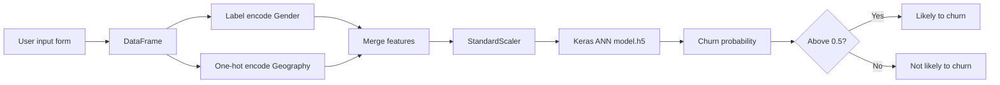

<div align="center">

# Customer Churn Prediction with ANN

**Predict which bank customers are likely to leave, using a TensorFlow/Keras neural network served through a Streamlit app.**

[](https://customerchurnpredictionmadhav.streamlit.app/)
[](https://www.python.org/)
[](https://www.tensorflow.org/)
[](https://scikit-learn.org/)
[](LICENSE)

[**Try the live app**](https://customerchurnpredictionmadhav.streamlit.app/) · [Report a bug](https://github.com/Madhavkumaryadav/Customer-Churn-Prediction-with-ANN-/issues) · [Request a feature](https://github.com/Madhavkumaryadav/Customer-Churn-Prediction-with-ANN-/issues)

</div>

<!-- Add a screenshot or GIF of the app, for example: -->
<!--  -->

---

## Table of contents

- [Overview](#overview)
- [Highlights](#highlights)
- [Tech stack](#tech-stack)
- [Architecture](#architecture)
- [Project structure](#project-structure)
- [Input features](#input-features)
- [Model](#model)
- [Getting started](#getting-started)
- [Usage](#usage)
- [Troubleshooting](#troubleshooting)
- [Roadmap](#roadmap)
- [Contributing](#contributing)
- [License](#license)
- [Author](#author)

---

## Overview

Keeping an existing customer is usually cheaper than winning a new one. This project trains a binary classifier on customer demographic and account data to estimate the probability that a customer will exit the bank, so retention teams can focus on the customers most at risk.

| | |
| --- | --- |
| **Problem** | Binary classification: will the customer churn (`Exited` = 1) or stay (`Exited` = 0)? |
| **Model** | Fully connected Artificial Neural Network (ANN) with a sigmoid output |
| **Output** | Churn probability between 0 and 1, with a 0.5 decision threshold |
| **Interface** | Streamlit web app with a probability gauge and risk level |
| **Deployment** | [Streamlit Community Cloud](https://customerchurnpredictionmadhav.streamlit.app/) |

## Highlights

- **Real-time predictions** from a simple form, with no code needed by the end user.
- **Training/inference parity:** the label encoder, one-hot encoder and scaler are saved with `pickle` and reused in the app, so inputs are transformed exactly as they were during training.
- **Clear risk communication:** the app shows the probability on a gauge, a low/moderate/high risk badge and a plain-language verdict.
- **Modern interface:** a responsive dark theme built with custom CSS on top of Streamlit.

## Tech stack

| Area | Tools |
| --- | --- |
| Language | Python 3 |
| Deep learning | TensorFlow, Keras |
| Preprocessing | scikit-learn (`LabelEncoder`, `OneHotEncoder`, `StandardScaler`), pandas, NumPy |
| Web app | Streamlit |
| Deployment | Streamlit Community Cloud |

## Architecture



## Project structure

```
.
├── app.py                      # Streamlit application
├── model.h5                    # Trained Keras model
├── level_encoder_gender.pkl    # Label encoder for Gender
├── geo_encoder.pkl             # One-hot encoder for Geography
├── scaler.pkl                  # StandardScaler fitted on training data
├── requirements.txt            # Python dependencies
├── LICENSE                     # MIT License
└── README.md
```

> Update this tree to match the repository, including any notebooks and the dataset file.

## Input features

| Feature | Type | Description |
| --- | --- | --- |
| `Geography` | Categorical | Customer's country (one-hot encoded) |
| `Gender` | Categorical | Customer's gender (label encoded) |
| `Age` | Numeric | Age in years |
| `CreditScore` | Numeric | Credit score |
| `Balance` | Numeric | Account balance |
| `EstimatedSalary` | Numeric | Estimated annual salary |
| `Tenure` | Numeric | Years as a customer (0 to 10) |
| `NumOfProducts` | Numeric | Number of bank products held (1 to 4) |
| `HasCrCard` | Binary | Has a credit card (0 or 1) |
| `IsActiveMember` | Binary | Is an active member (0 or 1) |

**Target:** `Exited` (1 = churned, 0 = stayed).

## Model

| Item | Details |
| --- | --- |
| Architecture | [ADD: e.g. Input → Dense(64, ReLU) → Dense(32, ReLU) → Dense(1, Sigmoid)] |
| Loss | [ADD: e.g. binary cross-entropy] |
| Optimizer | [ADD: e.g. Adam] |
| Train/test split | [ADD: e.g. 80/20] |
| Test accuracy | [ADD: your result] |

Numeric features are standardized with `StandardScaler`. The model outputs a probability, and a customer is flagged as likely to churn when it is above 0.5.

**Risk levels shown in the app**

| Probability | Level |
| --- | --- |
| 0.00 to 0.30 | Low risk |
| 0.30 to 0.50 | Moderate risk |
| Above 0.50 | High risk (likely to churn) |

## Getting started

### Prerequisites

- Python 3.9 or later
- `pip`

### Installation

```bash
# 1. Clone the repository
git clone https://github.com/Madhavkumaryadav/Customer-Churn-Prediction-with-ANN-.git
cd Customer-Churn-Prediction-with-ANN-

# 2. Create and activate a virtual environment (recommended)
python -m venv venv
source venv/bin/activate        # Windows: venv\Scripts\activate

# 3. Install dependencies
pip install -r requirements.txt
```

Example `requirements.txt`:

```
streamlit
tensorflow
scikit-learn
pandas
numpy
```

> Pin the versions you trained with (for example `scikit-learn==x.y.z`). Pickled encoders and scalers can fail to load under a different scikit-learn version.

### Run locally

```bash
streamlit run app.py
```

The app opens at `http://localhost:8501`.

## Usage

1. Choose the customer's **geography** and **gender**, and set their **age**.
2. Enter **credit score**, **balance** and **estimated salary**.
3. Set **tenure** and **number of products**, then toggle **credit card** and **active member**.
4. Select **Predict churn** to see the probability, risk level and verdict.

## Troubleshooting

| Problem | Likely cause and fix |
| --- | --- |
| `FileNotFoundError` for `model.h5` or a `.pkl` file | Run the app from the project root, and confirm all model and encoder files are committed. |
| Error while unpickling encoders or scaler | Install the same scikit-learn version used for training. |
| TensorFlow fails to install | Use a supported Python version for your TensorFlow release. |

## Roadmap

- [ ] Add evaluation results (confusion matrix, precision, recall, F1, ROC-AUC)
- [ ] Add model explainability (for example SHAP feature importance)
- [ ] Add hyperparameter tuning experiments
- [ ] Add unit tests for the preprocessing pipeline
- [ ] Containerize with Docker

## Contributing

Contributions are welcome.

1. Fork the repository.
2. Create a branch: `git checkout -b feature/your-feature`
3. Commit your changes: `git commit -m "Add your feature"`
4. Push the branch: `git push origin feature/your-feature`
5. Open a pull request.

## License

Distributed under the MIT License. See [`LICENSE`](LICENSE) for details.

## Author

**Madhav Kumar Yadav**

[](https://github.com/Madhavkumaryadav)

If you find this project useful, consider giving it a star.